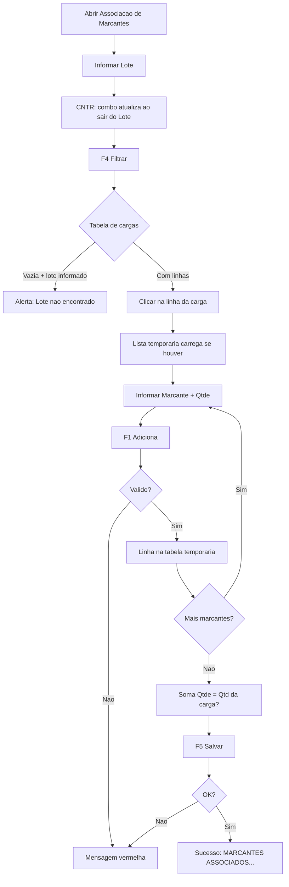

# Guia do usuário — Associação de Marcantes

| | |
|---|---|
| **Menu** | Home → **Associacao de Marcantes** |
| **URL** | `/AssociacaoMarcantes/Index` |
| **Objetivo** | Associar números de marcante a uma carga (lote/item) que ainda não possui marcantes vinculados, conferindo quantidades antes de gravar |

---

## Pré-requisitos

- Estar **logado** no Romaneio. Sem login, a tela redireciona para a Home.
- Saber o **lote** e/ou o **contêiner (CNTR)** da carga a associar.
- Ter **marcantes** válidos e ainda não utilizados (sem data de associação anterior).

---

## Visão da tela

1. **Filtro** — Lote (texto), CNTR (combo), botão **[F4] Filtrar**, indicador **EXP** (aparece em cargas de exportação).
2. **Tabela de cargas** — Linhas com lote, item, quantidade, embalagem, contêiner, mercadoria (clique na linha para selecionar a carga).
3. **Associação** — Marcante (até 9 dígitos), Qtde, **[F1] Adiciona**, **[F2] Remove**.
4. **Lista temporária** — Marcantes adicionados nesta sessão (clique na linha antes de remover).
5. **Ações finais** — **[F5] Salvar**, **[ESC] Sair** (volta ao menu Home).

Mensagens de erro ou sucesso aparecem no topo da página (faixa vermelha ou verde). Alerta de lote inexistente usa janela **SweetAlert** (*Lote nao encontrado*).

---

## Fluxo completo (passo a passo)

### 1. Acessar a tela

Home → **Associacao de Marcantes** → `/AssociacaoMarcantes/Index`.

### 2. Filtrar cargas elegíveis

1. Digite o **Lote** (opcional, mas usual para restringir).
2. Ao sair do campo Lote, o combo **CNTR** é preenchido com contêineres disponíveis para aquele lote.
3. Selecione um **CNTR** ou deixe *Selecione* para buscar mais amplo.
4. Clique **[F4] Filtrar** (ou tecla **F4**).

**Comportamento do filtro**

| Situação | O que acontece |
|----------|----------------|
| Cargas de **importação** encontradas | Tabela preenchida; indicador **EXP** oculto |
| Só cargas de **exportação** | Tabela preenchida; etiqueta **EXP** visível (amarela) |
| Lote informado e **nenhuma linha** | Popup *Lote nao encontrado* / *Nenhum item foi encontrado para o lote informado* |
| Sem lote e sem CNTR | Lista cargas atuais (`FLAG_HISTORICO = 0`) — [TODO] validar volume em homologação |

### 3. Selecionar a carga

1. Clique **uma linha** na tabela superior (fundo azul = selecionada).
2. A tabela **Marcante / Qtde** inferior recarrega os marcantes **já adicionados temporariamente** para aquela carga (se existirem de sessão anterior).
3. Os botões **Adiciona** e **Remove** habilitam quando há itens na tabela de cargas.

Sem linha selecionada, adicionar/remover/salvar exibe: **Carga nao selecionada**.

### 4. Adicionar marcantes (lista temporária)

1. Digite o **Marcante** (somente números, máximo 9).
2. Informe **Qtde** (número ≥ 1 no campo).
3. Clique **[F1] Adiciona** ou tecla **F1**.
4. Repita até a **soma das quantidades** na lista temporária igualar a **Qtd** da linha de carga selecionada (exigência do Salvar).

Campos são limpos após adicionar com sucesso; o foco volta ao Marcante.

### 5. Remover da lista temporária

1. Clique na linha do marcante na tabela inferior.
2. Clique **[F2] Remove** ou tecla **F2**.

Se nenhuma linha estiver selecionada: **Selecione um marcante para remover**.

### 6. Salvar associação definitiva

1. Com a carga selecionada e lista temporária completa (quantidades batendo).
2. Clique **[F5] Salvar** ou tecla **F5**.
3. Sucesso: faixa verde **MARCANTES ASSOCIADOS COM SUCESSO**; tabelas são limpas e o foco volta ao Lote.
4. Use **[ESC] Sair** (fora de campos de texto) para voltar ao menu Home.

---

## Validações

### Na interface (navegador)

| Momento | Regra | Mensagem |
|---------|--------|----------|
| Filtrar | Lote informado sem itens | *Lote nao encontrado* (SweetAlert) |
| Adicionar / Remover / Salvar / Carregar temp. | Nenhuma carga selecionada | Carga nao selecionada |
| Remover | Nenhuma linha na lista temp. | Selecione um marcante para remover |
| Marcante | Apenas dígitos | Caracteres não numéricos são removidos ao digitar |
| Falha de rede | AJAX com erro | Erro ao comunicar com o servidor. |
| Qualquer POST | Sessão expirada | Sessao caiu |

### No servidor — adicionar marcante (`AdicionarTemp`)

| Condição | Mensagem exata |
|----------|----------------|
| Marcante ≤ 0 | Informe o marcante |
| Qtde ≤ 0 | Informe a quantidade associada ao marcante |
| Já na lista temp. | Marcante ja adicionado |
| Não existe em `TB_MARCANTES` | Nr de marcante invalido |
| Já associado antes (`DT_ASSOCIACAO`) | Nr de marcante ja utilizado |
| Marcante de exportação em modo importação | Nr de marcante de carga de exportacao |
| Marcante EXP de outro lote | Marcante divergente ao lote exp. |

### No servidor — salvar (`Salvar`)

| Condição | Mensagem exata |
|----------|----------------|
| Nenhuma carga na requisição | Carga nao selecionada |
| Soma das qtde temp. ≠ qtde da carga | Quantidades divergentes |
| Erro na transação | Erro ao salvar associacao: {detalhe} |
| Sucesso | MARCANTES ASSOCIADOS COM SUCESSO |

!!! tip "Regra de quantidade"
    A soma das colunas **Qtde** na tabela temporária deve ser **igual** à coluna **Qtd** da linha de carga selecionada. Exemplo: carga com Qtd 10 → dois marcantes 6 + 4, ou um marcante 10.

### Atalhos de teclado

| Tecla | Ação |
|-------|------|
| F1 | Adiciona |
| F2 | Remove |
| F4 | Filtrar |
| F5 | Salvar |
| ESC | Sair (quando o foco não está em input/select/textarea) |

---

## Como testar

### Ambiente

1. Romaneio em homologação com login de operador.
2. Preview deste guia: `./serve.sh` na pasta `romaneio-documentation`.
3. Dados: cargas em `VW_WMS_SEM_MARCANTE` ou `VW_WMS_SEM_MARCANTE_CEXP` sem marcantes; marcantes livres em `TB_MARCANTES`.

[TODO] Obter com DBA/ambiente de teste: um lote importação, um lote exportação (EXP), marcantes válidos e já utilizados para cenários negativos.

### Roteiro funcional

| ID | Cenário | Passos | Resultado esperado |
|----|---------|--------|-------------------|
| T01 | Acesso sem login | Abrir URL direta sem sessão | Redireciona para Home |
| T02 | Acesso | Login → menu Associacao de Marcantes | Tela com filtros e tabelas vazias |
| T03 | Combo CNTR | Informar lote válido → sair do campo Lote | Combo CNTR com contêineres |
| T04 | Filtrar importação | Lote/CNTR de carga normal → F4 | Tabela com linhas; sem etiqueta EXP |
| T05 | Filtrar exportação | Lote/CNTR só exportação → F4 | Tabela com linhas; etiqueta **EXP** visível |
| T06 | Lote inválido | Lote inexistente → F4 | SweetAlert *Lote nao encontrado* |
| T07 | Selecionar carga | Clicar linha na tabela superior | Linha destacada; temp. carrega |
| T08 | Adicionar OK | Marcante válido + qtde → F1 | Nova linha na tabela temporária |
| T09 | Marcante inválido | Número inexistente → F1 | *Nr de marcante invalido* |
| T10 | Marcante já usado | Marcante já associado → F1 | *Nr de marcante ja utilizado* |
| T11 | Duplicar temp. | Mesmo marcante duas vezes → F1 | *Marcante ja adicionado* |
| T12 | Remover sem seleção | F2 sem linha na temp. | *Selecione um marcante para remover* |
| T13 | Remover OK | Selecionar linha temp. → F2 | Linha some |
| T14 | Salvar sem carga | F5 sem selecionar linha superior | *Carga nao selecionada* |
| T15 | Quantidades divergentes | Temp. somando ≠ Qtd da carga → F5 | *Quantidades divergentes* |
| T16 | Salvar OK | Temp. com soma = Qtd → F5 | *MARCANTES ASSOCIADOS COM SUCESSO*; limpa telas |
| T17 | Sair | ESC fora de campo | Volta ao Home |
| T18 | Sessão expirada | Esperar timeout → F4 ou F1 | *Sessao caiu* |

### Verificação após T16 (sucesso)

- Mensagem verde na tela.
- Marcantes passam a constar como associados (não devem aceitar nova associação — teste T10).
- [TODO] Confirmar com DBA consulta em `TB_MARCANTES` (`DT_ASSOCIACAO` preenchida, `AUTONUM_CARGA` ou `AUTONUM_CEXP`).

### Smoke rápido

1. Login → abrir tela → F4 com lote [TODO] → selecionar primeira linha → F1 com marcante [TODO] → F5.
2. Repetir com etiqueta **EXP** se houver dado de exportação.

---

## Observações para testadores

1. **Modo EXP** é definido automaticamente pelo filtro (tenta importação primeiro, depois exportação).
2. Após **Salvar** com sucesso, as tabelas são esvaziadas — não confundir com erro.
3. **Remover** só atua na lista **temporária**; associação já salva exige outro processo no sistema [TODO confirmar com negócio].
4. Se **Salvar** não retornar erro mas marcantes não atualizarem, verificar se a quantidade total da carga no banco já estava esgotada (lógica de limite no servidor) — reportar como possível inconsistência.
5. Título na tela e menu: *Associacao* (sem ç) — usar o mesmo texto ao redigir casos de teste.

---

## Referência (somente para quem mantém o guia)

Ao atualizar: `AssociacaoMarcantesController.cs`, `Views/AssociacaoMarcantes/Index.cshtml`, `Content/js/associacao-marcantes.js`.
