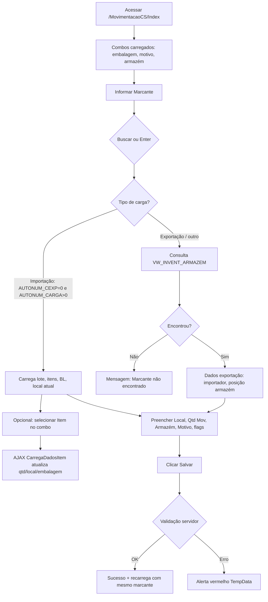

# Guia do usuário — Movimentação Carga Solta

| | |
|---|---|
| **Menu** | Home → **Movimentação Carga Solta** |
| **URL** | `/MovimentacaoCS/Index` |
| **Objetivo** | Registrar movimentação de volumes de carga solta (marcante) para um novo local/armazém, com motivo e flags de posicionamento |

---

## Pré-requisitos

- Estar **logado** no Romaneio (sessão `Logado`).
- Ter **pátio** selecionado na sessão (`Session["Patio"]`) — a lista de armazéns depende do pátio.
- Conhecer o **marcante** (etiqueta/código da carga) a movimentar.

!!! warning "Sessão"
    Se a sessão expirar, o sistema pode redirecionar para login ou falhar em telas auxiliares (ex.: exclusão de lacre retorna `"Sessao caiu"`).

---

## Visão da tela

A tela principal (`Index.cshtml`) está organizada em blocos:

1. **Cabeçalho** — Marcante, busca, quantidades, lote, BL, item (combo).
2. **Dados da carga** — Embalagem, mercadoria, marca, importador, datas, contêiner, IMO, mov. agendada (maioria somente leitura após busca).
3. **Movimentação** — Etiqueta prateleira, quantidade a movimentar, local (texto).
4. **Destino** — Armazém (combo do pátio), motivo (combo).
5. **Posicionamento** — Checkboxes FRENTE, FUNDO, LE, LD.
6. **Ações** — Salvar, Limpar, Histórico, Cargas CT.

---

## Fluxo completo (passo a passo)



### 1. Abrir a tela

- No menu inicial: clique em **Movimentação Carga Solta** (`Home.cshtml` → `~/MovimentacaoCS/Index`).
- O sistema carrega:
  - Tipos de **embalagem** (`TiposEmbalagens`);
  - **Motivos** ativos (`TB_CAD_MOTIVO`, `FLAG_ATIVO = 1`);
  - **Armazéns** do pátio logado (`ListaArmazens(PATIO)`).

### 2. Buscar o marcante

1. Digite o código no campo **Marcante**.
2. Clique **Buscar** ou pressione **Enter**.
3. A página recarrega com `?MARCANTE={valor}`.

**O que o sistema faz ao buscar**

| Cenário | Condição (código) | Resultado na tela |
|---------|-------------------|------------------|
| **Importação** | `ConsultarMarcante`: `AUTONUM_CEXP == 0` e `AUTONUM_CARGA > 0` | Preenche BL, lote, volumes, contêiner, local atual, lista de **itens** no combo, mercadoria/marca/IMO via lote |
| **Exportação / inventário armazém** | Caso contrário | Usa `ConsultarMarcanteInventArmazem` (`VW_INVENT_ARMAZEM`) |
| **Não encontrado** | Exportação e view vazia | Mensagem: **"Marcante não encontrado!"** |

### 3. Selecionar item (importação)

- Se o combo **Item** tiver opções, selecione uma linha (`ID_GRAVACAO`).
- O navegador chama `GET /MovimentacaoCS/CarregaDadosItem?ITEM={id}` e atualiza:
  - **Qtd.** (`QTD_EMBALAGEM`);
  - **Local** (`LOCAL` = armazém + posição);
  - **Embalagem** (seleciona opção pelo texto retornado).

Se o item não existir na view: alerta *"Conteiner não encontrado"* (mensagem JSON) ou *"Os dados não foram carregados"*.

### 4. Preencher a movimentação

| Campo | Editável | Observação |
|-------|----------|------------|
| Marcante | Sim | Mantém o valor para salvar e histórico |
| Qtd. Marcante / Lote / BL | Não* | Preenchidos na busca (*readonly na view) |
| Item | Sim (combo) | Obrigatório no **Salvar** (validação servidor) |
| Mercadoria, Marca, Importador, etc. | Não | Somente leitura após busca |
| **Etq. Prateleira** | Sim | Exibido no formulário; **não é gravado** pelo `SalvarDados` atual [ver observação](#observacoes-para-testadores) |
| **Qtd. Mov.** (`QTD_LOCAL`) | Sim | Quantidade movimentada |
| **Local** (`LOCAL`) | Sim | Texto do destino/posição (gravado como `YARD` no banco) |
| **Armazém** | Sim | Combo — obrigatório indiretamente (valor numérico `ARMAZEM`) |
| **Motivo** | Sim | Obrigatório no Salvar |
| FRENTE / FUNDO / LE / LD | Sim | Flags gravadas na movimentação |

### 5. Salvar

1. Clique **Salvar** (POST `SalvarDados`).
2. Em sucesso: faixa verde **"Informações salvas com sucesso!"** e a tela recarrega com o mesmo marcante.
3. Em erro: faixa vermelha com o texto retornado.

**Persistência:** `INSERT` em `SGIPA..TB_CARGA_SOLTA_YARD` (origem `'I'`), com `AUTONUM_CS`, armazém, yard/local, quantidade, motivo e flags.

### 6. Limpar

- Botão **Limpar** → `GET /MovimentacaoCS/Index` sem parâmetros (formulário vazio, combos mantidos).

### 7. Histórico

1. Informe o **Marcante** (campo não pode estar vazio para resultado útil).
2. Clique **Histórico**.
3. Modal lista movimentações de `TB_HIST_SHIFTING_CS`: data, local, armazém, usuário.

### 8. Cargas CT (tela auxiliar)

1. Selecione um **Armazém** no combo.
2. Clique **Cargas CT** → abre nova aba `CargasCT`.
3. Lista cargas do armazém (`VW_INVENT_ARMAZEM` por `DESCR_ARMAZEM`).
4. Na tela de cargas é possível gerenciar **Lacres** do armazém (inserir/excluir) — fluxo separado; ver seção [Telas auxiliares](#telas-auxiliares).

---

## Validações

### Na interface (comportamento imediato)

| Ação | Validação |
|------|-----------|
| Buscar marcante | Se o campo estiver vazio, nada acontece (script retorna sem navegar) |
| Carregar item | Sem item selecionado, AJAX não dispara |
| Histórico | Marcante vazio ainda chama o servidor (pode retornar lista vazia) |

### No servidor — `SalvarDados` (POST)

Todas as falhas abaixo redirecionam para `Index` com `TempData["MensagemErro"]` e preservam `MARCANTE` na URL quando possível:

| # | Regra | Mensagem |
|---|--------|----------|
| 1 | `MARCANTE` nulo | `Erro ao realizar salvar informações: informe o MARCANTE!` |
| 2 | `ITEM` nulo | `Erro ao realizar salvar informações: informe o ITEM!` |
| 3 | `MOTIVO` nulo | `Erro ao realizar salvar informações: informe o MOTIVO!` |
| 4 | `LOCAL` nulo | `Erro ao realizar salvar informações: informe o LOCAL!` |

!!! note "Campos não validados no controller"
    Não há checagem explícita de **Armazém**, **Qtd. Mov.**, **Etq. Prateleira** nem de sessão em `SalvarDados`. Erros de banco aparecem na mensagem genérica com o texto da exceção.

### Busca de marcante (GET `Index`)

| Situação | Mensagem / efeito |
|----------|-------------------|
| Exportação/inventário sem registro | `Marcante não encontrado!` |
| `Session["Patio"]` ausente | Exceção ao carregar armazéns [TODO: confirmar filtro global de login] |

### AJAX `CarregaDadosItem`

| Retorno | Mensagem / status |
|---------|-------------------|
| Item não encontrado | `Conteiner não encontrado`, `statusRetorno: 500` |
| Erro de execução | `Os dados não foram carregados` |

### Lacres (`ExcluirLacreCT`)

| Situação | Resposta JSON |
|----------|----------------|
| Sessão inválida | `{ success: false, message: "Sessao caiu" }` |
| Lacre inválido | `{ success: false, message: "Item não encontrado" }` |

---

## Telas auxiliares

### Cargas CT (`/MovimentacaoCS/CargasCT`)

- Parâmetros: `autonumArmazensIpa`, `cntrArmazem` (descrição do armazém selecionado).
- Exibe tabela de cargas no armazém contêiner.

### Lacres (partial no modal/página de cargas)

| Ação | Método | Validação |
|------|--------|-----------|
| Inserir lacre | POST `InsereLacreCT` | Armazém e lacre obrigatórios |
| Excluir lacre | POST `ExcluirLacreCT` | Sessão + `AUTONUM_LACRE` |

---

## Como testar

### Ambiente

1. Publicar/executar o projeto `Romaneio` (IIS Express ou IIS).
2. Login com usuário de operação de pátio.
3. Ter marcantes válidos no banco (importação e/ou exportação).

Documentação local desta pasta: na raiz de `romaneio-documentation`, execute `./serve.sh` e abra este guia no MkDocs.

### Dados de teste sugeridos

| Tipo | Onde obter | Uso |
|------|------------|-----|
| Marcante importação | `fnInvent_Sistemas_Arm_Col_patio` / ambiente de homologação | Fluxo com combo **Item** |
| Marcante exportação | `VW_INVENT_ARMAZEM` | Fluxo sem lista de itens; `ARMAZEM` pode ir como `0` |
| Marcante inválido | Código inexistente | Mensagem *Marcante não encontrado* |
| Motivo | `OPERADOR..TB_CAD_MOTIVO` (`FLAG_ATIVO=1`) | Qualquer opção ativa no combo |

Consulte o DBA ou scripts de homologação para códigos reais — **não use produção** sem autorização.

### Roteiro de testes funcionais

| ID | Cenário | Passos | Resultado esperado |
|----|---------|--------|-------------------|
| T01 | Acesso | Login → menu Movimentação CS | Tela abre com combos preenchidos |
| T02 | Busca importação | Marcante válido importação → Buscar | Campos preenchidos; combo Item com opções |
| T03 | Busca exportação | Marcante válido exportação → Buscar | Dados de `VW_INVENT_ARMAZEM`; local no formato `DESCR - POSICAO` |
| T04 | Marcante inválido | Código inexistente → Buscar | Alerta vermelho *Marcante não encontrado!* |
| T05 | Item AJAX | Selecionar item diferente | Qtd., Local e Embalagem atualizam |
| T06 | Salvar OK | Preencher Item, Local, Motivo, Armazém → Salvar | Mensagem verde; registro em `TB_CARGA_SOLTA_YARD` |
| T07 | Salvar sem Item | Limpar combo Item → Salvar | Erro *informe o ITEM!* |
| T08 | Salvar sem Local | Local vazio → Salvar | Erro *informe o LOCAL!* |
| T09 | Salvar sem Motivo | Motivo vazio → Salvar | Erro *informe o MOTIVO!* |
| T10 | Histórico | Após busca → Histórico | Modal com linhas de `TB_HIST_SHIFTING_CS` |
| T11 | Limpar | Limpar | Formulário sem marcante/dados |
| T12 | Cargas CT | Selecionar armazém → Cargas CT | Nova aba com lista; lacres abrem conforme UI |

### Verificação no banco (após T06)

```sql
-- [TODO] Ajustar marcante/autonum no ambiente de teste
SELECT TOP 5 *
FROM SGIPA..TB_CARGA_SOLTA_YARD
ORDER BY 1 DESC;
```

Campos esperados no insert: `AUTONUM_CS`, `ARMAZEM`, `YARD` (= Local), `QUANTIDADE`, `MOTIVO`, `FL_FRENTE`, `FL_FUNDO`, `FL_LE`, `FL_LD`, `ORIGEM = 'I'`.

### Testes manuais rápidos (smoke)

1. `GET /MovimentacaoCS/Index` autenticado → HTTP 200.
2. `GET /MovimentacaoCS/Index?MARCANTE={valido}` → página com dados.
3. `GET /MovimentacaoCS/CarregaDadosItem?ITEM={id}` → JSON `statusRetorno: 200` e `possuiDados: true`.

---

## Observações para testadores

1. **Campo Etq. Prateleira** aparece na tela mas **não** é enviado ao repositório em `SalvarDados` — registrar como melhoria se a regra de negócio exigir gravação.
2. **`AUTONUM_CS_YARD`** não há `HiddenFor` no formulário; o valor pode chegar zerado no POST salvo que o usuário não recarregou após busca — validar no teste T06 se o insert usa o autonum correto.
3. **Exportação** define `ARMAZEM = 0`; confirmar com negócio se inserts com armazém zero são aceitáveis.
4. **Histórico** com marcante vazio: comportamento indefinido — tratar como caso negativo no teste.

---

## Referência (somente para quem mantém o guia)

Ao atualizar este documento, consulte no código: `MovimentacaoCSController.cs`, `Views/MovimentacaoCS/Index.cshtml`.
